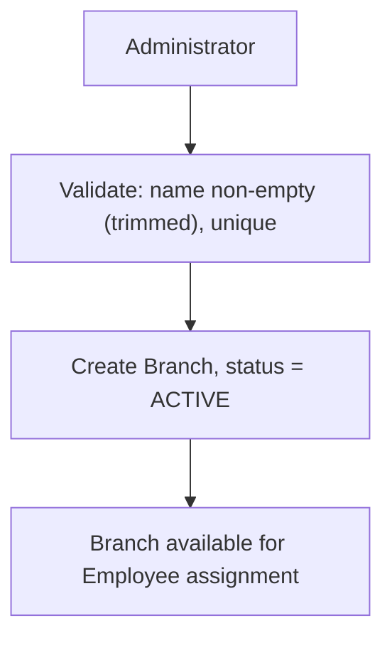
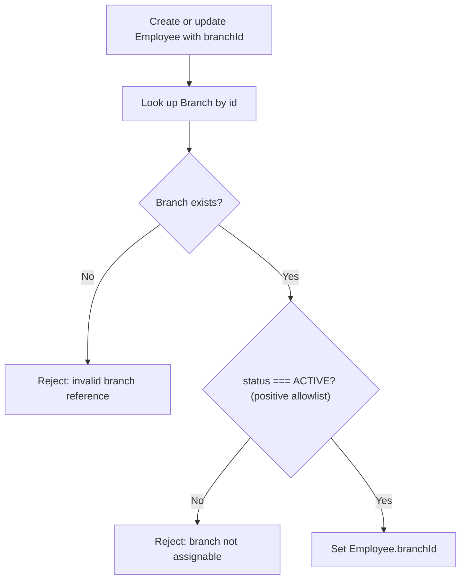
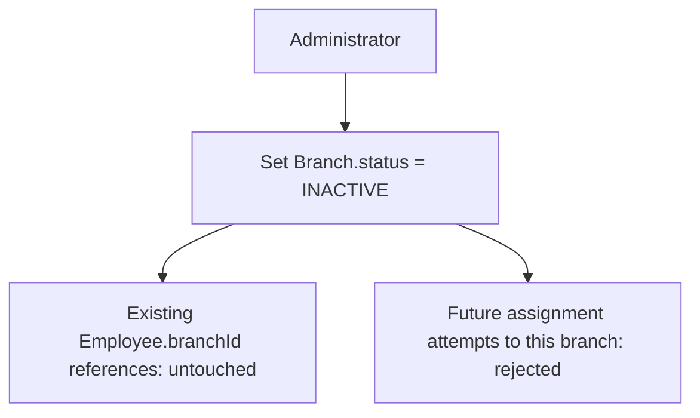
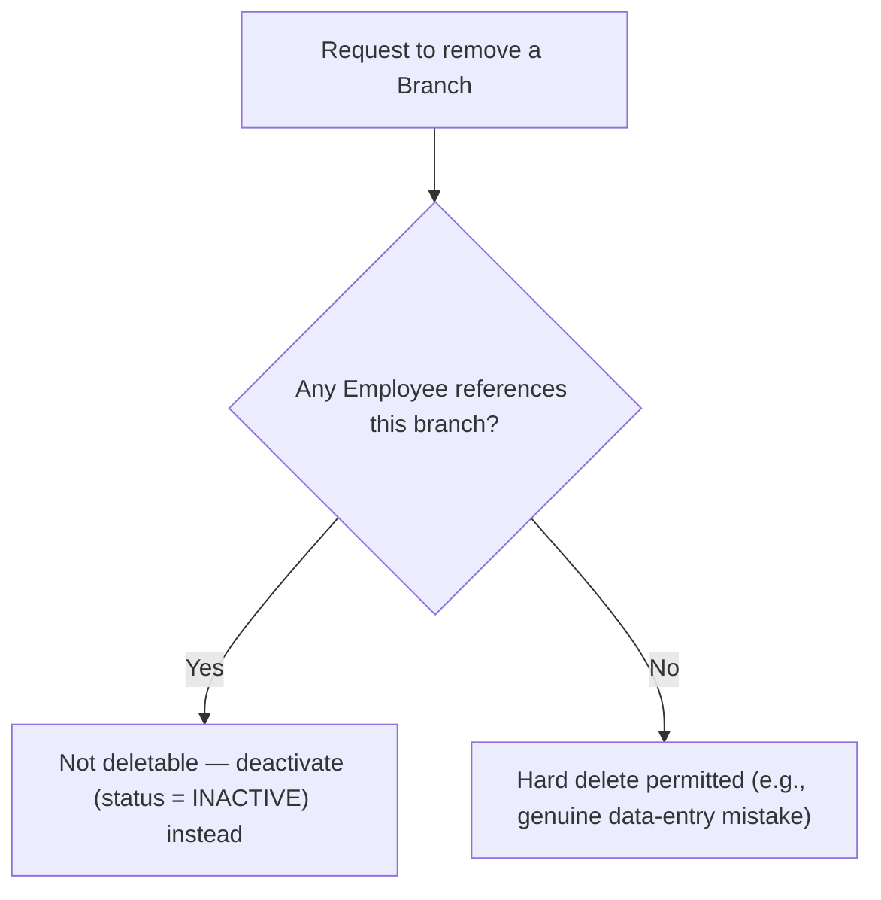

# Domain Sign-off — Branch

> This document is the permanent architectural record for the Branch domain. It
> is not an implementation guide. Future work — Branch's own implementation,
> and every future domain listed in §9 — must not contradict the decisions
> recorded here unless a genuine, documented contradiction makes the current
> design impossible to implement, in which case this document must be
> explicitly superseded, not silently drifted from.
>
> As with the Identity & Employee Lifecycle sign-off, this document
> distinguishes **verified fact** (what exists in code today), **architectural
> reasoning** (this review's own conclusions), **industry practice** (external
> precedent, not verified against this codebase), and **recommendation**
> (opinion, offered for approval, not fact) throughout.

---

## 1. Domain Overview

**Purpose.** Branch represents a physical and/or legal work location — an
office, plant, store, or regional entity an Employee is based out of. It exists
to answer a question the current schema cannot answer at all today: *where,
physically/legally, does this Employee work?*

**Business problems it solves.** Once an organization operates from more than
one location, several concerns become location-dependent in ways a single
free-text field cannot express: holiday calendars (region-specific), shift
timings (timezone-specific), and statutory/compliance boundaries
(jurisdiction-specific, directly load-bearing for the future Payroll domain).
None of this is representable today.

**Why this domain exists, verified.** `Employee.department` and
`Employee.jobTitle` are plain `String` columns (`schema.prisma`, verified) —
there is no location concept anywhere in the schema, not even as a free-text
stand-in the way department/title exist. Branch closes this gap as a
first-class entity rather than perpetuating the same free-text pattern that
this project has already identified (in the Identity & Employee Lifecycle
sign-off, §9) as a known limitation to fix, not a pattern to extend.

**Why Branch is not owned by Department, Employee, or a future Organization
entity** (architectural reasoning, worked through across this domain's Steps
1–3): Department and Branch are orthogonal classification axes (see §2);
embedding location directly on Employee as another free-text field would
repeat the exact mistake being corrected; and no Organization/tenant entity
exists or is planned (per the finalized single-organization deployment model)
for Branch to nest under. Branch sits at the top of the org-structure layer,
implicitly scoped to "the one customer this database represents."

---

## 2. Final Architectural Decisions

### Domain Definition
Branch is a physical/legal work location, modeled as its own aggregate root —
independent lifecycle, independent consistency boundary from `Employee`.
Minimal fields per the "build only what's needed" constraint: name, a short
code, and a status. Timezone, statutory identifiers, and holiday-calendar
references are explicitly not modeled yet (see §6).

### Aggregate Boundaries
Branch's aggregate contains only its own identity and lifecycle data. It does
not embed a list of Employees, Departments, or any other aggregate's data —
same reasoning already established for the User/Employee split: an
aggregate's boundary should cover only what it's responsible for enforcing.

### Ownership
`Employee` owns the FK (`branchId`), mirroring the existing
`Employee.userId`/`Employee.managerId` pattern — the more volatile entity
references the more stable master-data entity, never the reverse. Branch has
no reciprocal reference to Employee.

### Relationship to Department — Orthogonal, Not Hierarchical
**Decided and finalized**: Branch and Department are independent master-data
axes. Neither owns the other. An Employee will independently hold a
`branchId` and a `departmentId`. This was deliberately challenged (steelmanned
the hierarchical alternative: implicit valid-combination enforcement, simpler
scoped permissions, modeling genuinely divergent per-location structures) and
rejected in favor of orthogonality, grounded in real industry precedent
(**industry practice, not verified against this codebase**: Workday's
Location/Cost-Center-as-independent-Organization-Types model; SAP
SuccessFactors' Foundation Objects; Oracle HCM's independent
Location/Department objects — none model Department as owned by Location).
The deciding factor: the orthogonal model is the *lower-commitment* of the two
real options (Department must relate to Branch one way or the other the
moment Department is designed — there is no neutral third option), and it
directly supports the explicitly required query shape ("Engineering across
all branches") without duplicate-row aggregation risk.

### Relationship to Employee — Single Current Value, No History
**Decided and finalized (Decision 1)**: `Employee.branchId` is a single,
nullable, current-only value. No historical branch-assignment/transfer
tracking is modeled. If a future requirement (reporting, compliance, payroll,
attendance, or audit) demands historical tracking, it must be built as a
**separate assignment-history model**, never folded into the Employee
aggregate. This follows the same deferred-until-proven-necessary philosophy
already applied to Position, Grade, and multi-tenancy.

Optionality: `branchId` is nullable (not mandatory at Employee creation),
matching `userId`/`managerId` rather than the mandatory `department`/`jobTitle`
free-text fields — chosen specifically to accommodate remote employees without
forcing an arbitrary default branch just to satisfy a NOT NULL constraint.

### Lifecycle Model — Status Field, Not `deletedAt`
**Decided**: Branch uses a `status` field (e.g., active/inactive) rather than
reusing Employee's `deletedAt` soft-delete convention. Reasoning: Employee's
`deletedAt` models "this record was removed/no longer valid" (offboarding);
Branch closure is a distinct kind of business event (temporary suspension vs.
permanent closure) that carries meaning current and future domains
(Attendance, Payroll) may need to act on differently — collapsing it into a
boolean-style soft-delete would lose that distinction. This is a deliberate
departure from the Employee precedent, flagged as such rather than silently
diverging.

Hard delete remains disallowed once any Employee references a Branch — same
reasoning as why Employee itself never hard-deletes. A Branch with **zero**
Employee references may be hard-deleted outright (covers the genuine
data-entry-mistake case without needing a second "erroneous entry" flag — see
§11).

### Assignability Rule
**Decided**: "Is this branch assignable to a new/updated Employee" must be
implemented as a **positive allowlist check** (`status === ACTIVE`), never a
negative denylist (`status !== INACTIVE`). This costs nothing today (only two
status values exist) but guarantees a future third status value defaults to
*not* assignable rather than silently becoming assignable by omission.

### Repository / Service Responsibilities
Branch's repository owns only Branch's own persistence (create, find, list,
update, archive) — it must never contain an Employee-shaped query (e.g., "list
employees at this branch"), mirroring the verified precedent that
`employee.repository.js` never `include`s the `user` relation. Branch's
service owns validating its own invariants (§3) and exposing the assignability
check; it does not own the decision of what a caller does with that answer.

### Cross-Domain Interaction Pattern
**Decided**: cross-domain reads of Branch status (e.g., Employee assignment
validating a branch is active) happen via **synchronous, direct lookups** —
the same shape as every existing FK-validation check in this codebase
(`rethrowForeignKeyViolationAsBadRequest` precedent) — not via an event/message
bus. **Reasoning**: no event/message infrastructure exists anywhere in this
codebase today; introducing one solely for this would be speculative
complexity, explicitly ruled out by this project's stated design philosophy.
Revisit only if a real requirement for asynchronous cross-domain reactions
(e.g., auto-notifying affected employees on branch closure) appears.

### Permission Scoping — RESOLVED at implementation (ADR-B07)
**Decided (2026-09-13): `ADMIN`-only for all Branch mutations** (`branch:create`,
`branch:update`, `branch:delete`), matching this document's original
recommendation. `branch:read` is granted to all three roles (`ADMIN`,
`MANAGER`, `EMPLOYEE`) — non-sensitive reference data, needed for assignment
dropdowns and display, consistent with `department`/`jobTitle` being plain
visible fields on Employee today. This deliberately diverges from Employee's
scoping, where `MANAGER` has identical rights to `ADMIN` on every
`employee:*` permission (verified in `prisma/seed.js` at implementation
time) — justified because Branch is foundational org-structure master data
shared system-wide, where a mistake has a wider blast radius than a single
Employee record.

### Audit Logging Extension — RESOLVED at implementation (ADR-B08)
**Decided (2026-09-13): yes.** `AUDIT_ENTITY_TYPES.BRANCH` was added; every
Branch create/update/delete produces a transactional before/after `AuditLog`
snapshot, identical in shape to Employee's existing pattern.

---

## 3. Business Rules

**Mandatory rules (invariants) — approved:**
- Branch name must be non-empty after trimming.
- Branch must be uniquely identifiable within the single-customer deployment
  (name and/or code).
- Branches are never hard-deleted once referenced by any Employee.
- Existing Employee → Branch relationships must always remain intact —
  deactivating a Branch never modifies or nulls historical/current Employee
  assignments.

**Recommended practices (approved as architectural principles, not hard
invariants):**
- Inactive branches cannot be assigned to new Employees (or via Employee
  updates); existing Employees already assigned to a now-inactive branch
  remain valid.
- Branch models only fields required by current, verified business
  requirements — no speculative timezone/statutory/calendar fields yet.
- A Branch short code is accepted as a recommended (not mandatory) addition,
  anticipating Payroll/reporting's likely future need for a stable identifier
  distinct from the human-editable display name.

**Future considerations (explicitly not rules yet):**
- Whether deactivating a Branch with live Employee assignments should require
  an explicit confirmation/reason — no current rule demands this.
- Regional/hierarchical grouping of branches — not designed now.

---

## 4. Workflow Diagrams

### Branch creation

### Employee assignment to a Branch (create or update)

### Branch deactivation (archive)

### Branch removal (only when zero references)

---

## 5. Open Questions

Two items were explicitly raised during this review and were **not** resolved
before this sign-off was originally requested — carried forward rather than
silently decided at the time. **Both were resolved at the start of
implementation (2026-09-13)**, per ADR-B07/ADR-B08 in §2 above.

With those two exceptions now closed, this domain is considered
**architecturally complete and implemented for the current project scope.**

---

## 6. Deferred Decisions

| Deferred item | Why deferred |
|---|---|
| Historical branch-assignment/transfer tracking | No verified current requirement (Decision 1); if needed later, an additive separate model, not a change to Employee's aggregate. |
| Regional/hierarchical grouping of branches | No verified reporting requirement; additive relationship (`regionId`) if ever needed. |
| Timezone, statutory identifiers, holiday-calendar reference on Branch | No current consumer (Shift/Attendance/Payroll don't exist yet); additive nullable columns when those domains are reached. |
| Branch–Department valid-combination mapping | No current business rule demands preventing "nonsensical" combinations; additive join construct if ever required. |
| Scheduled/future-dated deactivation | No supporting infrastructure exists (no scheduler/cron anywhere in this codebase) and no verified requirement; would mean building infrastructure ahead of need. |
| Multi-branch-per-employee concurrent assignment | No verified requirement for an employee to be assigned to more than one branch at once; migrating a single FK to a join table later is additive, not destructive. |

---

## 7. Risks

| Risk | Impact | Likelihood | Mitigation |
|---|---|---|---|
| Permission scoping left unresolved | If implementation begins before this is decided, it risks being built inconsistently with `employee:*`'s existing scoping conventions, or silently defaulting to the wrong trust level for a structurally sensitive domain. | Medium — this is a live open question, not hypothetical. | Explicitly held open in §5; resolve before or at the start of implementation, not during it. |
| No mid-period branch-transfer attribution | Once Payroll/Attendance are designed, an Employee transferring branches mid-cycle cannot be retroactively attributed to the correct branch for that period, since only a single current `branchId` exists. | Low near-term (no Payroll/Attendance yet), but real and named the moment those domains are built. | Accepted trade-off per Decision 1; mitigation is the documented additive path (a separate assignment-history model) if/when a real requirement appears — not a silent gap. |
| Orthogonal Branch/Department model has no schema-level guard against nonsensical combinations | A branch could be assigned a department that doesn't operationally exist there, since nothing enforces valid combinations. | Low — a data-quality concern, not a referential-integrity one; no reported business need to prevent it. | Documented as an explicit, deliberate trade-off (§2); an optional mapping construct is the additive fix if this becomes a real problem. |
| Audit logging extension left unresolved | Branch mutations (especially deactivation) may go untracked from a compliance/traceability standpoint until this is decided. | Medium — same category as the permission-scoping risk; a live open question. | Explicitly held open in §5. |
| Branch list growth without pagination | If Branch's list capability is built as a flat, unpaginated query, it will hit the same scaling issue `GET /employees` and `GET /users` already solved. | Low near-term (branch counts are typically small), but a known, avoidable repeat of a solved problem if ignored. | Recommend reusing the existing `list-query-state` pagination/sort/filter convention at implementation time, rather than re-solving it. |

---

## 8. Assumptions

- Single-customer deployment scope, consistent with the finalized deployment
  model (one DB per customer) — Branch models locations *within* one
  customer's data, not across customers.
- Branch count per customer is expected to be modest (tens, not tens of
  thousands) under normal usage — informs, but does not block, the pagination
  recommendation in §7.
- No current statutory/payroll/attendance dependency exists yet — Branch is
  being built ahead of those domains, deliberately minimal.
- Branch management is administrator-driven, consistent with the same
  administrator-driven assumption already established for Employee
  onboarding/offboarding.
- This project's "enterprise-grade" ambition justifies modeling multi-location
  support as a real domain now, even if a given deployed customer today only
  operates a single location.

---

## 9. Impact on Future Domains

- **Department**: must treat its relationship to Branch as **orthogonal**, per
  §2 — must not introduce a `branchId` dependency on Department that would
  contradict this domain's finalized decision.
- **Designation, Employment Type, Grade**: unaffected by Branch directly; no
  dependency either way established here.
- **Shift, Holiday Calendar**: expected future consumers of Branch data
  (timezone, regional holiday scoping) — per §6, these fields will be added
  additively to Branch when those domains are reached, not retrofitted as a
  breaking change.
- **Attendance, Leave**: must key off `Employee.branchId` only for
  "current-location" concerns; must not assume historical branch-assignment
  data exists, since it deliberately does not (§2, Decision 1) — any
  branch-transfer-aware reporting these domains eventually need must trigger
  building the deferred assignment-history model, not assume it's already
  there.
- **Payroll**: must respect that `branchId` is nullable — a payable Employee
  may have no branch assigned (e.g., fully remote) — and must not assume
  every Employee resolves to exactly one statutory jurisdiction via Branch
  without a null-handling path.
- **Recruitment**: if a future hire is created with a branch assignment as
  part of onboarding, it must go through the same assignability check
  (positive allowlist, §2) as any other Employee branch assignment — no
  separate/bypass path.
- **Performance, Asset Management**: may scope by Branch (e.g., assets
  tracked per location) but must not assume `branchId` is always present.

**What future domains must never violate:**
1. Branch and Department remain independent — no future domain may impose a
   dependency between them that contradicts §2.
2. `Employee.branchId` is single-value and current-only — no future domain
   may assume historical accuracy without the (currently nonexistent)
   assignment-history model being built first.
3. Branch is never hard-deleted while referenced — any future domain adding a
   new reference to Branch inherits this constraint automatically.
4. The assignability check is a positive allowlist — any future domain
   introducing new Branch status values must preserve this, not weaken it to
   a denylist.

---

## 10. ADRs

**ADR-B01 — Branch as a First-Class Domain**
Status: Accepted
Summary: Replace the implicit location gap in `Employee` (no field at all,
unlike `department`/`jobTitle`'s free-text fields) with a first-class Branch
entity.
Consequences: Enables location-scoped rules for future domains (Shift,
Holiday Calendar, Payroll); requires Employee to gain a new nullable FK.

**ADR-B02 — Branch and Department Are Orthogonal, Not Hierarchical**
Status: Accepted
Summary: Branch and Department are independent classification axes; neither
owns the other; Employee references both independently.
Consequences: Supports cross-branch department reporting natively; carries no
schema-level guard against nonsensical branch/department combinations (§7
risk, accepted).

**ADR-B03 — Employee Holds a Single Current `branchId`, No History**
Status: Accepted
Summary: No historical branch-assignment tracking; a separate model would be
required if ever needed.
Consequences: Simple today; blocks accurate mid-period attribution for future
Payroll/Attendance until/unless the deferred model is built.

**ADR-B04 — Branch Lifecycle Uses a Status Field, Not `deletedAt`**
Status: Accepted
Summary: Deliberate departure from Employee's soft-delete convention, since
Branch closure carries different, non-binary business meaning.
Consequences: Introduces a second "is this record still active" idiom
alongside Employee's `deletedAt` — an accepted inconsistency, not an oversight.

**ADR-B05 — Branch Assignability Is a Positive Allowlist Check**
Status: Accepted
Summary: "Assignable" means `status === ACTIVE`, explicitly not `status !==
INACTIVE`.
Consequences: Zero cost today; guarantees safety if a third status value is
ever introduced.

**ADR-B06 — Cross-Domain Branch Status Checks Are Synchronous Reads**
Status: Accepted
Summary: No event/message-bus mechanism introduced for Branch status
propagation; direct lookups only, matching existing FK-validation precedent.
Consequences: Consistent with this codebase's current infrastructure; would
need revisiting only if genuine asynchronous cross-domain reactions become a
real requirement.

**ADR-B07 — Branch Permission Scoping**
Status: **Accepted; Implemented (2026-09-13)**
Summary: Branch mutations (`create`/`update`/`delete`) are `ADMIN`-only;
`branch:read` is granted to `ADMIN`+`MANAGER`+`EMPLOYEE`.
Consequences: Tighter than Employee's current `ADMIN`=`MANAGER` parity,
deliberately — Branch is foundational org-structure data.

**ADR-B08 — Branch Audit Logging Extension**
Status: **Accepted; Implemented (2026-09-13)**
Summary: Branch mutations extend the existing generic `AuditLog` model via
`AUDIT_ENTITY_TYPES.BRANCH`, identical in shape to Employee's pattern.
Consequences: Every Branch mutation is now traceable via the same audit
mechanism as Employee/User mutations.

---

## 11. Challenge This Design

*Acting as a second Principal Architect reviewing this work independently.*

**Weakness 1 — two of this review's own recommendations were never actually
confirmed** at design time, and could easily have been assumed settled by
implementation time. **Update (2026-09-13): both resolved explicitly at the
start of implementation** (§2/ADR-B07/ADR-B08), exactly per this document's
own §12 instruction, rather than silently assumed along the way.

**Weakness 2 — the no-history decision has a concrete, nameable failure
scenario**, not just an abstract limitation: a mid-cycle branch transfer
leaves future Payroll unable to retroactively attribute the correct branch
per portion of the period. Accepted deliberately (Decision 1), but named
explicitly here rather than left implicit.

**Weakness 3 — did Branch/Department orthogonality quietly violate this
domain's own YAGNI discipline?** Examined directly: unlike Position/Grade/
history (which have a genuine "don't build it yet" third option), Department
must relate to Branch one way or the other the moment it's designed — there
is no neutral state. Between the two real options, orthogonal is the
*lower*-commitment choice (no mandatory FK, no containment relationship to
unwind later), making it consistent with, not an exception to, this domain's
YAGNI discipline.

**Weakness 4 (reviewed, concluded not a real gap) — handling a Branch created
by genuine data-entry mistake.** Resolved without new schema: a Branch with
zero Employee references can be hard-deleted outright under the existing
"cannot hard-delete if referenced" rule; only a mistake discovered *after*
employees are already assigned is unhandled by schema, and that's rare enough
to handle operationally (reassign, then delete) rather than warranting a
second "erroneous entry" flag alongside `status`.

**Alternative approaches considered and rejected:**
- **Keep Branch as free text on Employee** (status quo pattern) — rejected;
  this is precisely the known gap this domain exists to close.
- **A generic "Location" entity with a type discriminator** (office/warehouse/
  retail) — rejected as speculative; no current requirement distinguishes
  branch types.
- **Hierarchical Branch → Department** — rejected in favor of orthogonality
  (§2), after being seriously steelmanned rather than dismissed.
- **A dedicated deactivation-reason field** — rejected; the existing generic
  `AuditLog` before/after snapshot already covers this without new schema
  (pending ADR-B08's resolution on whether Branch uses `AuditLog` at all).

---

## 12. Final Sign-off

**Is this domain ready for implementation?**
**Implemented.** Full Branch CRUD, permission scoping (ADR-B07), and audit
logging (ADR-B08) shipped 2026-09-13 on `feature/15-branch-domain`, with an
integration test suite and live verification against the real running
server (create/duplicate-rejection/list/deactivate/assignability-check/
delete-blocked-when-referenced, and permission enforcement for both `ADMIN`
and `EMPLOYEE` roles).

**Confidence score: 92%**
Reasoning: every structural/relationship question raised was resolved with
clear reasoning, cross-checked against real industry precedent where relevant
(Branch/Department orthogonality), and tested against this domain's own
stated YAGNI discipline rather than accepted at face value. Raised from 88%
now that both previously-open scoping questions are resolved and the design
has been verified against a real implementation rather than only reasoned
about. The remaining gap reflects the accepted, still-live trade-offs named
in §7 (no mid-period transfer history, no Branch/Department combination
guard) — real, but deliberate and documented, not oversights.

**Completed at implementation (2026-09-13):**
1. Permission scoping resolved and seeded (ADR-B07).
2. Audit-logging extension resolved and implemented (ADR-B08).

**Recommendation for the next domain to design, and why:**
**Department**, per the previously approved dependency graph and design
order. Department's own Step 3 (Relationships) now starts from a settled
premise — no dependency on Branch (§2, ADR-B02) — removing what was
previously the single largest open question hanging over Department's design
before this sign-off existed.
