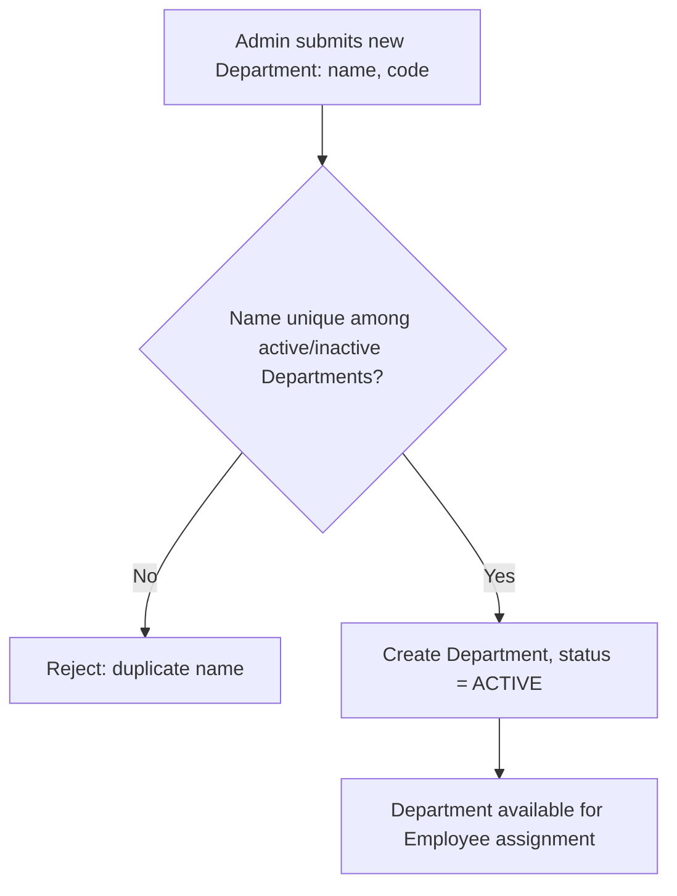
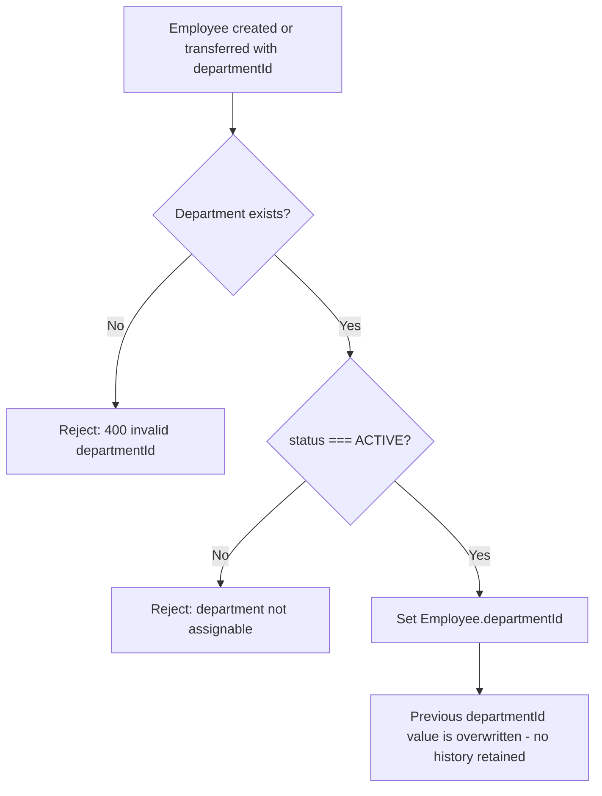
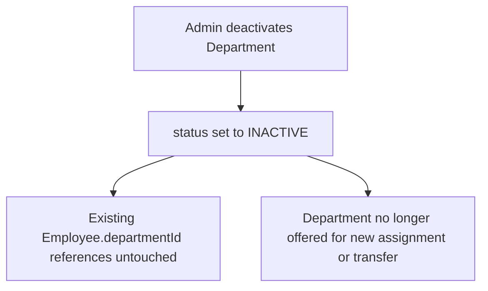
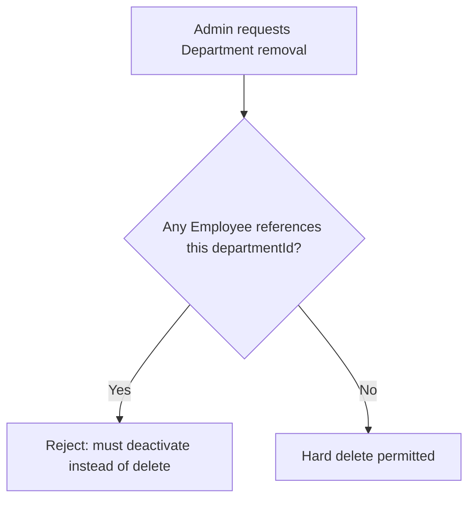

# Domain Sign-off: Department

## 1. Domain Overview

Department is the **functional/organizational classification** of an Employee — "what part of the business does this person work in" (Engineering, Sales, Finance, HR), as distinct from Branch, which answers "where does this person physically or administratively sit."

**Verified fact:** today, `Employee.department` (`prisma/schema.prisma:89`) is a plain required `String` column. It is free text: nothing prevents `"Engineering"`, `"engineering"`, and `"Enginering"` from coexisting as three distinct values with no relationship to each other. There is no dedicated Department entity, no uniqueness guarantee, no rename propagation, and no way to query "all employees in Engineering" without a fragile string match.

**Business problem this domain solves:** department attribution must be governed, not free-typed. Reporting, headcount analysis, org charts, and (later) cost-center/budget rollups in Payroll all depend on a stable, canonical set of department values. Promoting Department to a first-class domain gives it exactly what Branch got: a name that can be corrected in one place and have the correction apply everywhere, a status lifecycle, and a single point of truth for "does this department exist and is it currently in use."

**Why no other domain can own it:** Employee needs to *reference* a department but has no legitimate reason to *define* what departments exist — that would mean department governance lives in 30 different Employee rows instead of one place, which is exactly today's free-text problem. Branch cannot own it either: Branch and Department are independent classification axes (this was decided for Branch in [[domain-branch]] ADR-B02, and that decision is immutable — see §9). A department is not a kind of branch, and a branch is not a kind of department; a company can have one Engineering department split across three branches, or one branch hosting five departments.

## 2. Final Architectural Decisions

**Domain Definition** — Department is its own aggregate, minimal by design: `id`, `name`, `code` (optional short identifier), `status`. No embedded headcount, budget, or manager fields.
*Classification: Recommendation, applying the same minimalism principle already accepted for Branch.*

**Aggregate Boundaries** — Department owns only its own identity fields. It does not embed or cache Employee records, headcount counts, or any data belonging to another aggregate.
*Classification: Architectural reasoning, direct precedent from Branch.*

**Ownership of the Employee↔Department link — Employee owns the FK.** Mirrors the existing `userId`/`managerId`/`branchId` pattern: `Employee.departmentId` references `Department.id`. Department itself never stores a list of its employees; that is always queried from the Employee side.
*Classification: Architectural reasoning, direct precedent from Branch (ADR-B01-equivalent) and from the existing `Employee.userId`/`managerId` pattern.*

**Relationship to Branch — Orthogonal, Not Hierarchical (reaffirmed, not re-decided).** This is not a new decision; it is the direct consequence of ADR-B02, which is treated as immutable per the user's standing constraint. Department's own architecture is built on top of that settled premise rather than reopening it.
*Classification: Verified — inherited from an already-accepted ADR.*

**Departmental Hierarchy — Flat, Not Nested (for now).** Real organizations often nest departments (Engineering → Platform → Backend). This domain deliberately does **not** model that today: `Department` has no `parentDepartmentId`. Every department is a flat, top-level entry.
*Classification: Recommendation, argued in §7.*

**Relationship to Employee — Single Current Value, No History.** `Employee.departmentId` holds one current value; there is no department-transfer-history model. This mirrors the Branch decision (ADR-B03) for the same reason: a full transfer-history/effective-dating model is a legitimate future need (useful once Payroll needs to prorate cost-center allocation mid-period) but is not required by any verified requirement today, and can be added additively later without breaking this design.
*Classification: Recommendation, direct precedent from Branch Decision 1.*

**Employee.departmentId is mandatory, not nullable — a deliberate divergence from Branch.** Branch's `branchId` was made nullable ([[domain-branch]] Decision 1) because branch assignment can legitimately lag hire date for some employee types. Department is different: today's schema already treats `department` as `String` **required** (not `String?`) — every Employee row has always had a department value from the moment of creation. There is no verified business scenario where an employee exists without a functional department. Converting the free-text column to a FK should preserve that existing mandatoriness rather than loosening it.
*Classification: Recommendation, but grounded in a verified fact (the current column's non-nullability) rather than analogy alone — flagged explicitly because it is a point where Department's design intentionally does NOT copy Branch's.*

**Lifecycle Model — Status Field, Not `deletedAt`.** Same reasoning as Branch (ADR-B04): closing a department is an organizational restructuring event, not a soft-delete of a record whose absence should be invisible to related aggregates. `status: ACTIVE | INACTIVE`.
*Classification: Recommendation, direct precedent from Branch.*

**Assignability Rule — Positive Allowlist.** A department can only be assigned to an Employee (at hire or at transfer) when `status === ACTIVE`. Never implemented as `status !== INACTIVE`, so a future third status value defaults to non-assignable, not assignable.
*Classification: Recommendation, direct precedent from Branch (ADR-B05).*

**Repository/Service Responsibilities** — Department repository owns only Department's own persistence (create, rename, activate/deactivate, existence/status lookup). It never performs Employee-shaped queries (e.g., "list employees in this department" belongs to the Employee repository, filtering on `departmentId`, exactly as `employee.repository.js` already never embeds `user` — see [[domain-identity-employee-lifecycle]] for that precedent).
*Classification: Architectural reasoning, direct precedent.*

**Cross-Domain Interaction Pattern — Synchronous Direct Reads.** Identical to Branch (ADR-B06): when Employee creation/update assigns a `departmentId`, the orchestrating service performs a synchronous existence + status check against the Department repository, the same shape as the existing FK-violation-to-400 pattern (`rethrowForeignKeyViolationAsBadRequest`). No event bus exists in this codebase; building one now for Department alone would be speculative.
*Classification: Verified precedent (no event infrastructure exists) + recommendation (extend the same synchronous pattern).*

**Permission Scoping — RESOLVED at implementation (ADR-D08).** **Decided (2026-09-13): `ADMIN`-only** for Department mutations (`create`/`update`/`delete`), matching Branch's resolution (ADR-B07) exactly. `department:read` is granted to all three seeded roles.
*Classification: Verified fact (implemented and seeded).*

**Audit Logging Extension — RESOLVED at implementation (ADR-D09).** **Decided (2026-09-13): yes.** `AUDIT_ENTITY_TYPES.DEPARTMENT` was added; every Department mutation produces a transactional before/after `AuditLog` snapshot.
*Classification: Verified fact (implemented).*

## 3. Business Rules

**Mandatory invariants:**
- Department `name` must be non-empty after trimming, and unique (case-insensitive) among non-archived departments — preventing the exact "Sales" vs "sales" duplication problem that exists today as free text.
- A Department can never be hard-deleted while any Employee references it via `departmentId` (mirrors Branch's rule exactly).
- Deactivating (archiving) a Department never modifies any existing `Employee.departmentId` value — employees keep their historical department attribution even after that department is closed.
- `departmentId` is mandatory on Employee creation (see §2) — an Employee cannot exist without a department, consistent with the current schema's required `String department`.

**Recommended practices (not hard invariants):**
- An inactive Department is not assignable to new employees or as a transfer target, but pre-existing assignments remain valid and readable (positive-allowlist rule, §2).
- Department `code` (e.g., `ENG`, `FIN`) is recommended for future integrations (payroll cost-center codes, reporting exports) but not made mandatory today — no verified requirement forces it yet.
- Keep the Department aggregate to identity fields only; resist adding `headOfDepartmentId`, `budget`, or `costCenter` fields until a domain that actually consumes them (Payroll, Performance) is designed and confirms the need.

**Scalability concerns:**
- Department list is expected to be small (tens, not thousands, of rows) for the vast majority of adopting organizations — unlike Employee or AuditLog, pagination is a low-severity concern, though the existing `list-query-state` frontend pattern should still be reused for consistency if/when a Department list UI is built.

## 4. Workflow Diagrams

### Department Creation

### Employee Assigned to a Department (hire or transfer)

### Department Deactivation

### Department Removal

## 5. Open Questions

Both resolved at implementation start (2026-09-13), per §2/ADR-D08/ADR-D09:
1. **Permission scoping** — `ADMIN`-only, matching Branch (ADR-B07).
2. **Audit logging** — yes, extends `AuditLog` (`entityType: "Department"`).

Neither was a structural question — they did not block designing subsequent domains, and their resolution here does not retroactively change any other domain's design.

## 6. Deferred Decisions

| Decision | Reason for Deferral |
|---|---|
| Departmental hierarchy (`parentDepartmentId`) | No verified requirement demands nested departments today; additive migration path (nullable self-FK) available later without breaking this design. |
| Department-transfer history / effective-dating | Needed only if a future domain (Payroll cost-center proration) requires it; not required now. |
| Cost center / budget fields on Department | Belongs to a future Payroll/Finance domain's design, not Department's own minimal identity. |
| Department-based permission scoping (e.g., a Manager can only manage their own department's employees) | No verified requirement yet; current RBAC model (see Identity sign-off) is role-based, not department-scoped. |
| Head-of-department designation | Overlaps with the not-yet-designed Designation/reporting-line concepts; premature to add here. |

## 7. Risks

| Risk | Impact | Likelihood | Mitigation |
|---|---|---|---|
| Permission scoping left open (ADR-D07) | Medium | Medium | Resolve before or at implementation start, same as Branch's equivalent open item. |
| Audit logging left open (ADR-D08) | Low | Medium | Same mitigation — cheap to add, does not block other domains. |
| No department-transfer attribution for future Payroll cost-center reporting | Medium | Low (only matters once Payroll is designed) | Explicitly flagged as a deferred, additive concern in [[domain-branch]]'s Risks table for the analogous Branch case; same logic applies here. |
| Flat (non-hierarchical) model may prove insufficient for large/matrixed organizations | Low–Medium | Low | Additive migration path (nullable `parentDepartmentId`) preserves this design; see §7's self-challenge below. |

## 8. Assumptions

- It is assumed (industry practice, not verified against a specific customer requirement) that most adopting organizations operate with a flat or shallow department list, not deep multi-level hierarchies, at least initially.
- It is assumed that `Employee.department` (current free-text column) will, when implemented, be migrated to `Employee.departmentId` via a data-backfill step that creates one Department row per distinct existing string value — this is a migration-mechanics concern, noted here only because it explains why Department's rules assume mandatory/non-nullable `departmentId` from day one of the new model, not because this document is specifying implementation.

## 9. Impact on Future Domains

Any future domain must never violate:
1. Branch and Department remain independent, orthogonal classification axes (inherited, immutable — ADR-B02).
2. `Employee.departmentId` is single-value, current-only, and **mandatory** (unlike `branchId`, which is nullable).
3. Department is never hard-deleted while referenced by any Employee.
4. Department assignability is always a positive allowlist (`status === ACTIVE`), never a negative denylist.
5. Department carries no embedded headcount, budget, or hierarchy data unless and until a future domain's design explicitly justifies adding it via additive migration.

This most directly constrains the future **Designation** domain (which may or may not scope job titles within a Department — an open question for Designation's own Step 3, not resolved here) and the future **Payroll** domain (which will likely want a cost-center concept that today's minimal Department does not provide).

## 10. Architecture Decision Records

**ADR-D01 — Department as a First-Class Domain**
Status: Accepted
Summary: Promote `Employee.department` from free-text `String` to a governed `Department` aggregate with its own identity, uniqueness, and lifecycle.
Consequences: Requires a future schema migration (`Employee.department` String → `Employee.departmentId` FK) and a one-time data backfill; out of scope for this document to specify.

**ADR-D02 — Department/Branch Orthogonality (Inherited)**
Status: Accepted (inherited from ADR-B02, immutable)
Summary: Department and Branch remain independent axes; neither owns nor nests the other.
Consequences: Employee independently references both `branchId` and `departmentId`.

**ADR-D03 — Single Current departmentId, No History**
Status: Accepted
Summary: No department-transfer-history model now; deferred to a future additive model if ever needed.
Consequences: No mid-period cost-center proration possible until/unless this is revisited.

**ADR-D04 — Status Field, Not deletedAt**
Status: Accepted
Summary: Department lifecycle uses `status: ACTIVE | INACTIVE`, not Employee's `deletedAt` soft-delete convention.
Consequences: Deliberate departure from Employee's pattern, consistent with Branch's own departure for the same reasoning.

**ADR-D05 — Positive Allowlist Assignability**
Status: Accepted
Summary: Department assignability is always checked as `status === ACTIVE`.
Consequences: Any future status value defaults safely to non-assignable.

**ADR-D06 — Synchronous Cross-Domain Reads**
Status: Accepted
Summary: Employee-side department assignment validation is a synchronous existence+status check, not event-driven.
Consequences: Consistent with Branch (ADR-B06); revisit only if an event/message infrastructure is introduced project-wide.

**ADR-D07 — departmentId Mandatory (Not Nullable)**
Status: Accepted
Summary: Unlike Branch's nullable `branchId`, Department's FK is mandatory on Employee, preserving the current schema's non-nullable `department` column semantics.
Consequences: Employee creation must always supply a valid, active `departmentId`; no "unassigned department" state is representable.

**ADR-D08 — Permission Scoping**
Status: Accepted; Implemented (2026-09-13)
Summary: Department mutations (`create`/`update`/`delete`) are `ADMIN`-only; `department:read` is granted to `ADMIN`+`MANAGER`+`EMPLOYEE`.

**ADR-D09 — Audit Logging Extension**
Status: Accepted; Implemented (2026-09-13)
Summary: Department mutations extend the generic `AuditLog` model via `AUDIT_ENTITY_TYPES.DEPARTMENT`.

## 11. Challenge This Design

**Weakness 1 — Mandatory departmentId is a real usability constraint, not just a data-integrity nicety.** Making `departmentId` mandatory means Employee creation now hard-depends on at least one Department already existing (chicken-and-egg for a brand-new tenant/company). Branch avoided this by being nullable. Counter-argument: this is a one-time bootstrapping concern solvable by seeding a default Department (or requiring department creation before first hire), not a reason to weaken the invariant — the current schema already forces this same bootstrapping requirement (department is already required String), so this design changes nothing about that constraint, it only formalizes it.

**Update (2026-09-13, implementation):** this bootstrapping concern was real, not hypothetical. The dev database held 30 Employee rows with 12 distinct free-text `department` values, including obvious test-data noise (`"wefswedf"`, `"A"`, `"Test"`) alongside real ones (`"Engineering"`, `"Eng"` as a separate, un-normalized value, `"Finance"`, etc.) — a live confirmation of exactly the ungoverned-string problem this domain exists to fix (§1). The backfill (`prisma/backfill-department.js`) created one Department row per distinct existing string, verified zero Employee rows left with a null `departmentId` before the contract migration dropped the old column, and lost no data. No semantic merging of near-duplicates (e.g. `"Eng"` vs `"Engineering"`) was attempted — that is a data-quality cleanup decision for an admin to make post-migration via ordinary rename/deactivate operations, not something this migration should decide unilaterally.

**Weakness 2 — Flat-only hierarchy may be wrong for large enterprises.** Real organizations often need Engineering → Platform → Backend nesting for reporting rollups. Rejected for now anyway, because: (a) no verified requirement demands it, (b) a self-referencing nullable `parentDepartmentId` is a trivially additive migration — adding it later breaks nothing built today, (c) premature hierarchy invites premature reporting/rollup logic that has no consumer yet. If challenged to pick the opposite path, the counter-argument for building hierarchy now would be "it's cheap to add a nullable self-FK up front, so why not." Rejected because "cheap to add" is true both now and later, so deferring costs nothing while building it now carries the ongoing cost of a field every reader must understand before it has any consumer.

**Weakness 3 — Should Department and Branch really be two separate domains, or one generalized "OrgAxis" domain with a type discriminator?** This is the same alternative that was explicitly considered and rejected for Branch (a generic "Location"-with-type-discriminator entity, see [[domain-branch]] §11). The same rejection applies here with equal force: collapsing Department and Branch into one polymorphic table would blur two aggregates with different lifecycle rules today (Department is mandatory, Branch is optional) and different future trajectories (Department is heading toward cost-center/hierarchy concerns; Branch toward timezone/statutory-calendar concerns) — a shared table would need to grow type-conditional columns almost immediately, the opposite of high cohesion.

**Alternatives considered and rejected:**
- Nested/hierarchical Department from day one — rejected, no verified need, additive path exists (§7 Weakness 2).
- Generic polymorphic "OrgUnit" table shared with Branch — rejected, blurs distinct lifecycles (§7 Weakness 3).
- Department as a sub-concept of Designation (job title implies department) — rejected: conflates "what function" with "what role/title," which are independently variable (two Backend Engineers can sit in different departments in a matrixed org; a future Designation domain should not be forced to encode department).

**Recommendation stands:** flat, orthogonal, mandatory-FK Department, exactly as specified in §2, with ADR-D08/D09 left genuinely open.

## 12. Final Sign-off

**Implementation readiness:** **Implemented.** Full CRUD, permission scoping (ADR-D08), and audit logging (ADR-D09) shipped 2026-09-13 on `feature/16-department-domain`, including the breaking `Employee.department` (String) → `Employee.departmentId` (mandatory FK) migration via a real expand-migrate-contract sequence against live dev data (see Weakness 1's update above), a 6-test integration suite, and full live verification.

**Confidence score: 91%**
Raised from 87% now that the mandatory-FK migration — the one part of this design with no direct Branch precedent to lean on — has been executed against real (if messy) data and verified, not just reasoned about.

**Completed at implementation (2026-09-13):** ADR-D08 (permission scoping) and ADR-D09 (audit logging) resolved and seeded.

**Recommended next domain:** Designation — it is the natural next master-data domain, and its Step 3 (Relationships) must explicitly decide whether job titles are scoped within a Department or remain independent, a question this document deliberately left for Designation to answer rather than pre-empting here (§9).
