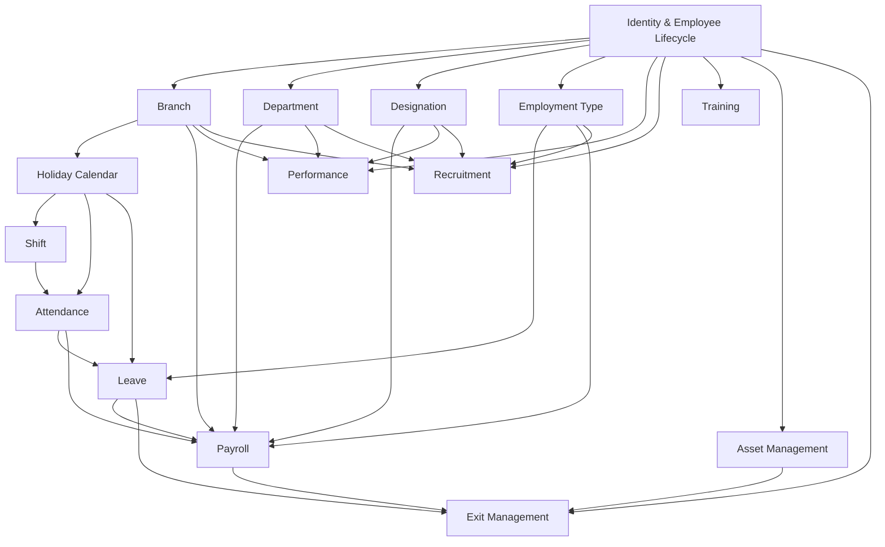

# HRMS/ERP Domain Dependency Graph

This is the authoritative dependency map for every business domain designed in this architecture review, superseding the illustrative Phase 1 sketch with the actual dependency structure that emerged as each domain was designed in sequence.

## Graph

## Reading the Graph

An arrow `A --> B` means **B reads from / depends on A**, not that A knows about B. Every dependency in this review is a one-directional synchronous read (or, in exactly two cases — Recruitment's Hire Orchestration Service and Exit Management's Exit Orchestration Service — a single triggered invocation of an unmodified Identity primitive). No domain in this graph ever writes into another domain's aggregate; see [[cross-domain-relationship-matrix]] for the full read/write breakdown.

## Actual Design Order (as executed)

1. **Identity & Employee Lifecycle** — foundational; every other domain references `Employee` or `User`.
2. **Branch** — first orthogonal classification axis.
3. **Department** — second orthogonal axis, explicitly independent of Branch (ADR-B02/ADR-D02).
4. **Designation** — third orthogonal axis, extending the same independence principle (ADR-DS02).
5. **Employment Type** — the one classification axis modeled as a closed enum, not a managed aggregate (ADR-ET01), because its values carry downstream calculation significance.
6. **Holiday Calendar** — first domain with a genuine hierarchical relationship (Branch → HolidayCalendar → Holiday), picking up Branch's own deferred "holiday-calendar field" item.
7. **Shift** — recurring working-pattern axis; explicitly excludes what Holiday Calendar excludes (weekly off-days belong here, dated exceptions belong there).
8. **Attendance** — first transactional/ledger-shaped domain; consumes Holiday Calendar + Shift to compute effective daily status.
9. **Leave** — consumes Employment Type (entitlement), Holiday Calendar (duration calculation), and is read by Attendance (never writes to it — ADR-AT03/ADR-LV-side confirmation).
10. **Payroll** — the heaviest consumer in the graph: reads Employment Type, Attendance, Leave, Department, Designation, and Branch, snapshotting all of them into an immutable Payslip.
11. **Performance** — lighter-weight consumer of Department/Designation/Branch (for org-context snapshotting) and Identity (`managerId` reuse); deliberately independent of Attendance/Leave/Payroll.
12. **Recruitment** — upstream of Identity's onboarding, not downstream; depends on Department/Designation/Branch/Employment Type to define requisitions, and triggers (never modifies) Identity's onboarding primitive.
13. **Training** — depends only on Identity (Employee existence); deliberately no dependency on Department/Designation (auto-targeting explicitly deferred, ADR-TR03).
14. **Asset Management** — depends only on Identity; the one domain that builds full history now rather than deferring it (ADR-AM01), justified as inherent to its purpose.
15. **Exit Management** — the structural mirror of Recruitment; depends on Asset Management (active-assignment query), Payroll (final settlement trigger), and Leave (encashment policy, still open — ADR-LV06), and triggers (never modifies) Identity's offboarding primitive.

## Why This Order Held Up

The Phase 1 illustrative order was challenged and refined domain-by-domain rather than followed blindly:
- Master-data axes (Branch, Department, Designation, Employment Type) were sequenced first because every later domain assumes they exist, and each was tested for orthogonality vs. hierarchy independently rather than assumed identical (Employment Type broke the pattern deliberately — ADR-ET01).
- Holiday Calendar and Shift were sequenced before Attendance because Attendance cannot define "late" or "absent" without both an expectation (Shift) and an exception calendar (Holiday Calendar) already existing.
- Leave was sequenced after Attendance specifically so its central relationship decision (ADR-LV-equivalent of AT03: never write into Attendance) could be reasoned about against an already-settled Attendance design, not a hypothetical one.
- Payroll was sequenced after Attendance and Leave because it is their heaviest downstream consumer — designing it earlier would have meant guessing at both domains' output shapes instead of consuming settled ones.
- Recruitment and Exit Management were sequenced last, deliberately bookending the list, because both are structurally about *surrounding* Identity's already-finalized onboarding/offboarding primitives rather than depending on the operational domains in between — Recruitment could in principle have been designed immediately after the four master-data axes, and Exit Management immediately after Identity alone; they were placed at the ends of the sequence to mirror the natural "hire → operate → separate" business narrative, not because of a hard technical dependency forcing that position.

## Cross-References

- Full relationship detail: [[cross-domain-relationship-matrix]]
- Every ADR across every domain: [[adr-index]]
- Every explicitly deferred decision: [[deferred-decisions-register]]
- Implementation sequencing recommendation: [[future-roadmap]]
