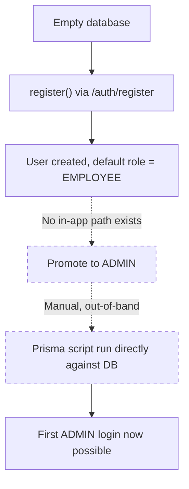
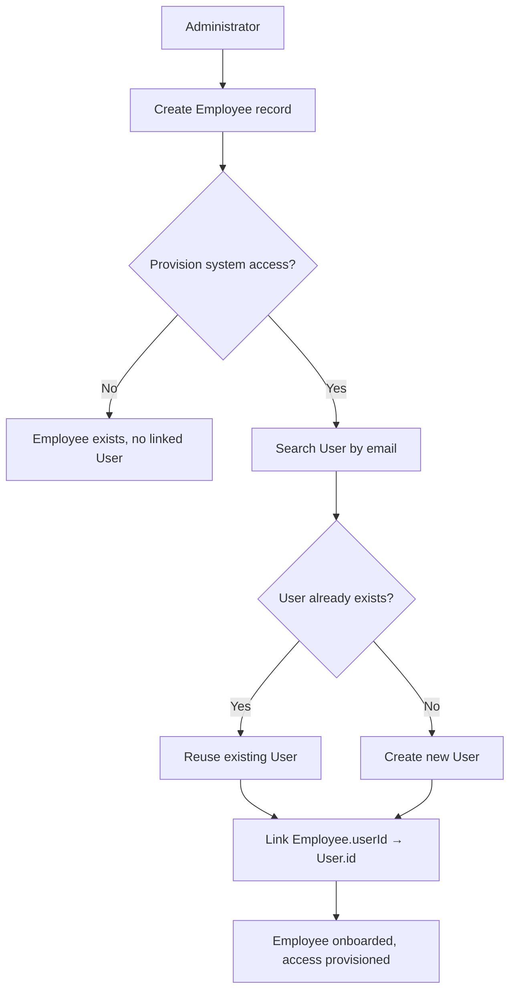
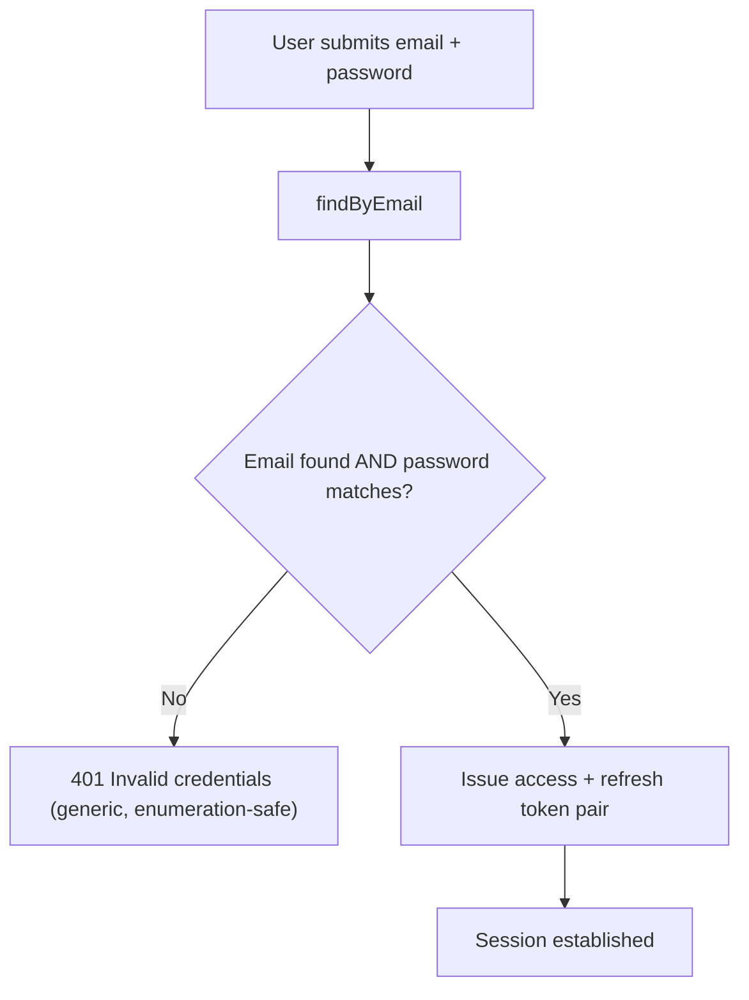
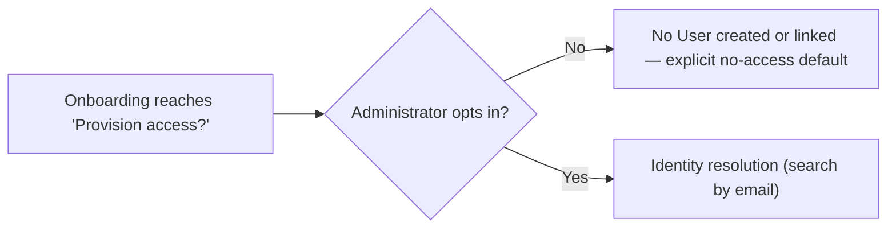
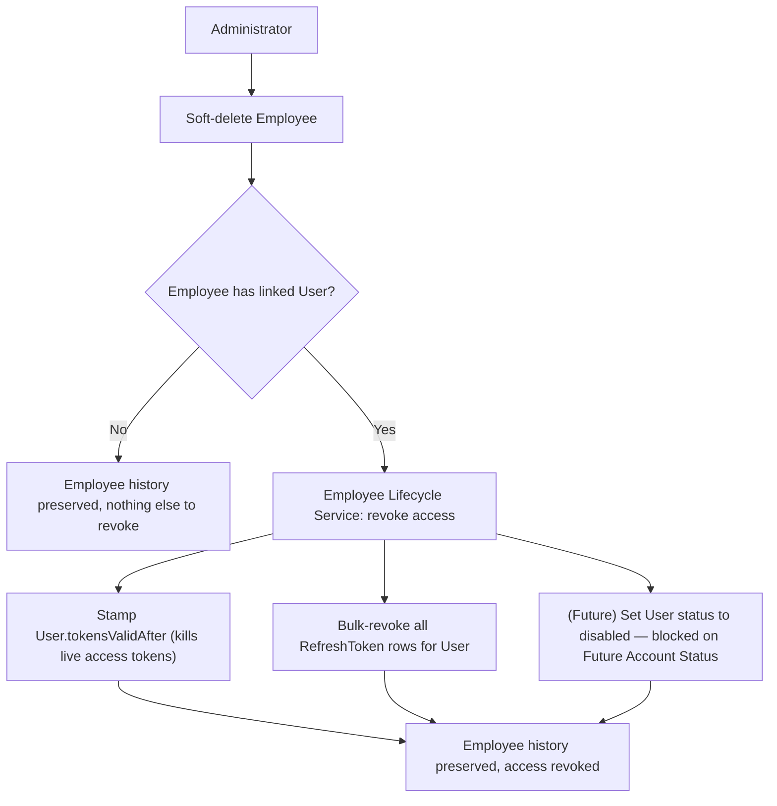
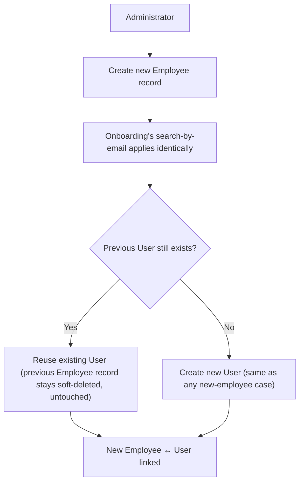

# Domain Sign-off — Identity & Employee Lifecycle

> This document is the permanent architectural record for the Identity & Employee
> Lifecycle domain. It is not an implementation guide. Future work in this domain
> must not contradict the decisions recorded here unless a genuine, documented
> contradiction with another domain makes the current design impossible to
> implement — in which case this document must be explicitly superseded, not
> silently drifted from.
>
> A note on honesty of record: some decisions below are **finalized architecture,
> not yet built in code**. Wherever that gap exists, it is called out explicitly,
> per this project's own established convention (`backend/CLAUDE.md`) of never
> describing an idealized version of the system as if it were the current one.

---

## 1. Domain Overview

**Purpose.** This domain answers one question for the entire application: *who is
allowed to act, and who is being managed?* It is split deliberately into two
concepts because those are two different questions with two different owners,
two different lifecycles, and two different failure modes.

**Business problems it solves.**
- How does a person authenticate and get authorized to perform actions (login,
  sessions, permissions)?
- How does the organization track a person as an HR/business record (department,
  job title, salary, manager, tenure, employment history) regardless of whether
  that person can ever log in?
- How does the organization connect the two — without forcing them to always
  exist together?

**Why this domain exists.** Every other future domain (Attendance, Leave,
Payroll, Recruitment, Performance, Asset Management — see §9) depends on there
being a stable, unambiguous answer to "who is this person, as an employee" and
"who is this person, as a system identity." Getting this domain wrong is
expensive precisely because everything else is built on top of it.

**Why User and Employee are separate business concepts** (not merely separate
tables): a "system identity" and a "business/HR identity" are genuinely
independent facts about a person in any real organization:
- A person can be a tracked HR record with a real department, salary, and
  manager and *never* have system access (no legitimate reason to log in).
- A person can hold valid system credentials before HR onboarding is complete,
  or after HR has soft-deleted their record (e.g. a rehire scenario — see §2,
  Rehire Strategy).
- The two records have different lifecycles: `User` currently has no delete
  path at all; `Employee` has full soft-delete + audit trail (verified,
  `backend/prisma/schema.prisma`, `employee.service.js`).
- The two have different owners in the business: HR/management typically own
  the Employee record's truth; IT/security own the User record's truth. Forcing
  them into one entity forces one owner to be authoritative over facts that
  aren't really theirs.

This is **architectural reasoning**, not a documented historical rationale — no
design doc predates this codebase's decision to separate them. It is, however,
the reasoning that was used across this review to validate the separation is
still correct going forward, not merely inherited.

---

## 2. Final Architectural Decisions

### Deployment Model
Single-organization deployment. One deployment = one customer = one database.
Multi-tenancy is intentionally postponed (see §6). **Verified fact**: no
`Organization`/tenant model exists anywhere in `schema.prisma` today — this
decision matches, rather than contradicts, the current implementation.

### User Domain Responsibilities
Authentication, authorization (roles/permissions via `Role`/`Permission`/
`UserRole`/`RolePermission`), sessions, refresh tokens, and (future) account
status. `User` represents a **system identity**, not an employee. **Verified
fact**: this matches the current schema and module boundaries exactly — nothing
HR-shaped exists in `user.repository.js` or `auth.service.js`.

### Employee Domain Responsibilities
HR identity, department, manager, salary, employment lifecycle, historical
employment records. `Employee` represents a **business identity**, not a login
account. **Verified fact**: matches current schema — nothing auth-shaped exists
in `employee.repository.js`.

### Aggregate Boundaries
`User` and `Employee` are separate aggregates, each with its own consistency
boundary. `Employee` may reference a `User` by id; `User` has no reciprocal
knowledge of `Employee` at the aggregate level (the schema's `User.employees`
back-relation is a query convenience, not a business dependency in the other
direction).

### Relationship Ownership
`Employee` owns the `userId` foreign key. **Reasoning**: schema ownership and
process ownership are different axes — Employee owning the FK does not imply
Employee (the module) owns the *orchestration* of linking (see Employee
Lifecycle Service, below). This distinction was explicitly worked through in
this review and is a load-bearing point, not a minor detail.

### Employee.userId Ownership
Nullable, deliberately **not** schema-unique — enforced instead by a
hand-written partial unique index scoped to `WHERE deletedAt IS NULL`
(`schema.prisma:101-107`, verified). This models `User`→`Employee` as
conceptually one-to-many across time (one user, potentially many Employee rows
over a career — see Rehire Strategy), while still guaranteeing at most one
*live* Employee per User at any moment.

### Identity Resolution
`User.email` is the only schema-enforced (`@unique`) identity key in the system
today. There is no employee code or other business identifier anywhere in the
schema. **Decision**: onboarding must always resolve identity by searching for
an existing `User` by email *before* deciding to create a new one — in every
onboarding scenario, not just some (new hire, rehire, contractor with existing
access, pre-created User, accidental self-registration all reduce to the same
"search first" operation, differing only in business narrative, not in
mechanism).

### Employee Lifecycle
Employee onboarding and offboarding are both orchestrated through a dedicated
**Employee Lifecycle Service** — a new module, not yet built, sitting alongside
(not inside) `employees/` and `auth/`/`users/`. **Reasoning precedent**: this
mirrors `auth.service.js`'s existing `register()`, which already orchestrates
`userRepository` + `rbacRepository` together from a third module rather than
folding that orchestration into either owned module. The same shape is proposed
here, at one level up: Employee Lifecycle Service orchestrates `employee`'s and
`user`'s repositories/services without living inside either.

### Onboarding
```
Administrator
  → Create Employee
  → Provision System Access? (explicit, optional decision)
      → Search User by Email
          → Reuse Existing User
          OR
          → Create New User
      → Link Employee ↔ User
```
**Decision**: access-provisioning is never automatic and never assumed — it is
always an explicit sub-decision inside onboarding, defaulting to *no access*
until the administrator opts in. This is the "asymmetric lifecycle defaults"
principle (architectural opinion, explicitly flagged as such during the
review, grounded in fail-secure/least-privilege reasoning): granting access
should require a positive, deliberate action; nothing should silently produce
access as a side effect of an unrelated action (like just creating an HR
record).

### Offboarding
Default behavior, also orchestrated by the Employee Lifecycle Service:
- Disable system access.
- Terminate active sessions.
- Revoke refresh tokens.
- Preserve Employee history (no hard delete).

**⚠ Implementation status — decided, not yet built.** This is the mirror-image
default to onboarding's opt-in default: offboarding defaults to *revoking*
access, requiring an explicit exception to preserve it, rather than requiring
an explicit action to revoke it. **Verified fact**: as of this review,
`softDeleteEmployee` (`employee.service.js:181-204`) does none of this — it
only writes the `Employee` soft-delete and an audit-log row, inside one
`prisma.$transaction`. It makes zero calls into any User-related
repository/service today. Closing this gap requires:
1. A new bulk "revoke all refresh tokens for a user" method —
   `refreshToken.repository.js` currently only exposes a single-row `revoke(id)`
   (verified, full file read). Small, mechanical addition.
2. Stamping `User.tokensValidAfter` to kill live access-token sessions
   immediately — the mechanism already exists and is already proven (built for
   the multi-tab-logout fix) and requires no new invention, only reuse.
3. A genuinely new `User` status/"disabled" field to prevent re-login entirely
   — **does not exist today** (`User` has no status field of any kind; `login()`
   checks only email existence + password match). This is the one piece with no
   existing building block to reuse — tracked under Future Account Status below.

### Rehire Strategy
Rehire creates a **new** `Employee` row and reuses the existing `User` row (if
one exists and is appropriate to reuse per identity resolution above). Historical
Employee records are preserved, never overwritten or deleted. This is exactly
what `Employee.userId`'s partial-unique-index design already supports at the
schema level (verified) — the business decision and the existing schema
constraint agree.

### Session Handling
`User.tokensValidAfter` invalidates all currently-live access tokens the
instant it's stamped (verified, already built, already proven in production
use via the multi-tab-logout fix). `RefreshToken.revoked` is a per-row boolean.
This domain's decision is that both mechanisms are the correct building blocks
for offboarding's "terminate sessions" / "revoke refresh tokens" requirements —
no new session-invalidation mechanism needs to be invented, only extended to a
bulk, user-scoped operation (see Offboarding above).

### Future Account Status
Explicitly deferred, not designed in this pass (see §6). Recorded here only to
note that Offboarding's "prevent re-login entirely" requirement is blocked on
it. **Verified fact**: no `isActive`/status/disabled field of any kind exists
on `User` today; `login()` has zero account-status check anywhere in its path.

### Authentication Flow
Unchanged by this domain review — `login()` checks `findByEmail` +
`bcrypt.compare`, issues an access/refresh token pair per the already-existing,
already-implemented Feature 7 design. This review did not revisit or challenge
that flow; it is out of scope, not silently re-endorsed as ideal.

### Registration Policy
`register()` unconditionally assigns the hardcoded `DEFAULT_ROLE_NAME =
'EMPLOYEE'` (verified, `auth.service.js:37-62`). No branch assigns any other
role. This means self-registration currently produces a `User` with no linked
`Employee` and no elevated role — consistent with the onboarding decision above
(a self-registered `User` is exactly the "User exists, unlinked" case that
onboarding's search-by-email step is designed to find and link later).

### Login Flow
Unchanged (see Authentication Flow). No account-status gate exists yet; this is
the direct, known consequence of Future Account Status being deferred, not an
oversight in this review.

### Employee Lifecycle Service
The single orchestration point for onboarding and offboarding, described
above. Not yet built. Its exact scope — whether it is one "lifecycle" module
covering both onboarding and offboarding, or two more narrowly-scoped modules —
was raised as an open question during this review and is recorded, unresolved,
in §5.

---

## 3. Business Rules

**Mandatory rules (invariants — violating these breaks the design):**
- A `User` may exist without an `Employee`.
- An `Employee` may exist without a `User` (`userId` nullable).
- `Employee` owns the relationship (`userId` FK); `User` never references
  `Employee` at the aggregate level.
- At most one **live** (non-soft-deleted) `Employee` may reference a given
  `User` at any time (enforced today via the partial unique index).
- Onboarding must always search for an existing `User` by email before
  deciding whether to create a new one — never create-first.
- Access provisioning during onboarding is optional and must be an explicit
  decision, never an automatic side effect of creating an `Employee`.
- Offboarding (Employee soft-delete with access revocation) must never delete
  or mutate historical `Employee` data — history is preserved unconditionally.
- Rehire always creates a new `Employee` row; it must never resurrect
  (un-soft-delete) a prior one.
- If access is provisioned during onboarding, `Employee`+`User` link creation
  must be wrapped in a way that a partial failure never leaves an
  inconsistent state (an `Employee` believing it's linked to a `User` that
  doesn't exist, or a stray unlinked `User` silently orphaned by convention —
  not by database constraint, since `userId` is nullable and optional by
  design).

**Recommended practices (this review's reasoning, not hard invariants):**
- Offboarding should default to revoking access; preserving it should require
  an explicit, recorded exception/reason rather than being the default outcome
  of every soft-delete.
- Cross-entity orchestration (onboarding/offboarding) should live in a
  dedicated service, not inside either `employees/` or `auth/`/`users/`,
  mirroring the existing `auth.service.js` precedent.
- External side effects tied to lifecycle events (e.g., a future invite email)
  should fire only after the relevant transaction commits, best-effort — the
  same ordering already proven correct for Cloudinary cleanup in Feature 12.

**Future considerations (not yet rules — flagged for later domains/passes):**
- Whether *every* Employee soft-delete should trigger access revocation, or
  only ones explicitly typed as "termination" (as opposed to a data-correction
  soft-delete) — raised but not resolved in this review (see §5).
- Whether Employee Lifecycle Service should expose a distinguishable "reason"
  or "type" for offboarding events at all.

---

## 4. Workflow Diagrams

### Initial deployment → bootstrap administrator

**⚠ Verified fact, not a designed workflow**: no bootstrap-admin mechanism
exists in this codebase. The only way any account has ever become `ADMIN` is a
manual, out-of-band Prisma script — documented honestly and repeatedly across
`backend/CLAUDE.md` (Features 8, 9, 13, and the Users-pagination entry). This
review did **not** design a first-admin workflow; it is recorded here as an
explicit, currently-unsolved gap, not silently implied to be solved.



### Employee onboarding



### Login



### Access provisioning (as a sub-flow of onboarding)



### Offboarding



### Rehire



---

## 5. Open Questions

This domain is **not** fully closed — one architectural question from this
review was left explicitly unanswered when the discussion paused, and should
not be assumed resolved:

- **Should the Employee Lifecycle Service be scoped as a single "employee
  lifecycle" service covering both onboarding *and* offboarding, or should
  offboarding be a separate module/concern from onboarding?** This was the
  exact open question posed at the end of the offboarding discussion and was
  never answered before this sign-off was requested. Recorded here rather than
  silently decided one way in this document.
- Should every Employee soft-delete trigger access revocation unconditionally,
  or only soft-deletes explicitly typed/reasoned as a real termination (as
  opposed to a data-correction)? Raised in §3's "future considerations," not
  resolved.

With those two exceptions, this domain is considered **architecturally
complete for the current single-organization project scope** — every other
question originally queued for this review (self-registration, first-admin
bootstrap reality, identity resolution scenarios, relationship ownership,
rehire behavior, session/token revocation mechanics) was explicitly discussed
and resolved above.

---

## 6. Deferred Decisions

| Deferred item | Why deferred |
|---|---|
| Multi-tenancy / Organization entity | Explicit finalized decision: single-org, one-DB-per-customer deployment model for the foreseeable scope. Revisit only if a real multi-customer deployment requirement appears — do not design for it speculatively. |
| Email invitations (invite-to-activate flow) | No email-sending mechanism exists anywhere in the backend today (verified — zero matches for `invite`/`nodemailer`/`sendgrid`/`mailer`/`sendEmail`). Onboarding today assumes an administrator directly creates or links access; invitation-based activation is a real future enhancement, not a current requirement. |
| SSO / future identity providers | No stated business need yet; email/password is the only authentication mechanism in scope. Introducing this later should not require re-litigating the User/Employee separation — it only affects how `User` credentials are established, not the domain boundary. |
| Employee Code (a second business identifier) | Today, email is the only enforced unique identity key. An employee code would be a genuine enhancement for organizations that assign identifiers independent of email (which can change), but was not required to resolve any question in this review. |
| Password reset improvements | Out of scope of Identity & Employee Lifecycle's boundary questions — a pure authentication-flow concern, not a User/Employee relationship concern. |
| Position management (seat-based headcount, vacancy tracking) | Raised during the broader HRMS dependency-graph discussion (Phase 1 of the next domain pass), not this domain. Flagged here only because it would eventually interact with Employee. Intentionally deferred per YAGNI reasoning until an explicit business need for seat/vacancy tracking (distinct from just "who currently holds this job") appears. |
| Future Account Status (`User` disabled/active field) | The one genuinely new piece of schema this domain's decisions require but does not yet have. Deferred as its own implementation unit rather than bundled into this sign-off, since it's a real, nontrivial addition (new column, new login-time check, migration of existing rows) rather than a reuse of an existing mechanism. |

---

## 7. Risks

| Risk | Impact | Likelihood | Mitigation |
|---|---|---|---|
| Email-only identity matching | Two people who share/rotate an email (or a mistyped email at signup) could fail to resolve to the correct User during onboarding, causing either accidental account reuse or accidental duplicate creation. | Low today (single org, presumably controlled email issuance), but grows if the org later has non-corporate or shared emails. | Documented as the one true identity key now, so any future duplicate-handling logic has a clear, single source of truth to reason about; revisit if a second business identifier (Employee Code) is introduced. |
| Account status not yet implemented | Offboarding's "prevent re-login entirely" step cannot be fully honored until this exists — a soft-deleted Employee's linked User can still authenticate today if their access token/refresh token haven't yet been revoked through the not-yet-built bulk-revoke mechanism, and forever if that mechanism is itself not yet built. | High until built — this is a known, named functional gap right now. | Tracked explicitly in §2 (Offboarding) and §6 (Deferred Decisions) as the next concrete implementation unit for this domain; not silently assumed solved. |
| Bootstrap administrator process is entirely manual/out-of-band | Any real deployment depends on someone with direct database access running a script — this doesn't scale to a customer-operated deployment model and is a genuine operational risk if this product is ever handed to a non-technical customer to self-host. | Certain to matter the moment a deployment isn't operated by the development team itself. | Named honestly rather than hidden; not solved in this review since it wasn't the topic in scope — recommend it as an early candidate for a future security/operations-focused pass, separate from the domain-modeling work covered here. |
| Future migration to multi-tenancy | If multi-tenancy is ever required, every current assumption ("one User table, one Employee table, no Organization scoping") becomes a real migration project, not a config flag. | Low near-term (explicitly deferred, no stated business driver), but non-zero long-term for any product with growth ambitions beyond single-customer deployments. | Deliberately not designed around today, per the finalized deployment-model decision — the cost of guessing wrong on multi-tenancy shape now (row-level tenant_id vs. schema-per-tenant vs. current db-per-tenant) is higher than the cost of migrating later with real requirements in hand. |
| Employee Lifecycle Service scope is still an open question (§5) | Building it prematurely against the wrong boundary (one service vs. two) risks the same kind of retrofit this review was trying to avoid for Payroll-adjacent domains later. | Medium — this is a live open question, not a hypothetical. | Explicitly held open in §5 rather than guessed at in this sign-off; resolve before implementation begins, not during it. |

---

## 8. Assumptions

- Single-organization deployment; one database per customer.
- This is an internal enterprise application (administrator-driven data entry
  is an acceptable operating model — not a self-service consumer product).
- Onboarding and offboarding are administrator-driven actions, not
  self-service employee actions.
- Email uniqueness is a reliable, sufficient identity signal for the current
  scale and deployment model.
- The existing `tokensValidAfter` and `RefreshToken.revoked` mechanisms are
  sufficient building blocks for session/token revocation — no new
  session-management primitive is assumed necessary, only new orchestration
  over the existing ones.
- No current business requirement for an employee to belong to multiple
  organizations or multiple branches — this was explicitly listed as a
  future question and was not required to be resolved to close this domain.

---

## 9. Impact on Future Domains

Every domain identified in the broader HRMS dependency-graph discussion
ultimately anchors to `Employee`, not `User` — this is a direct consequence of
§1's separation (business identity, not login credential, is what HR-shaped
domains actually need a foreign key to).

- **Department, Branch, Designation**: expected to attach to `Employee`
  (replacing today's free-text `department`/`jobTitle` fields — a known,
  named gap, not a hidden one). These domains **must not** attempt to relate
  to `User` directly; doing so would violate the Employee/User boundary this
  domain just finalized.
- **Attendance, Leave**: must key off `Employee`, not `User` — attendance and
  leave are HR/business facts about a person's employment, not about their
  system session. A person with no `User` (no system access) can still
  conceptually accrue leave as an HR record; a domain design that requires a
  `User` to exist for Attendance/Leave to function would silently reintroduce
  the coupling this review deliberately avoided.
- **Payroll**: must key off `Employee` (salary, employment type, grade all
  live there), and must not assume every payable Employee has a `User` — this
  domain's own business rules (§3) explicitly allow Employee-without-User.
- **Recruitment**: sits *upstream* of this domain, not downstream — a
  successful hire is the trigger event that invokes Employee Lifecycle
  Service's onboarding entry point. Recruitment must not attempt to create a
  `User` directly; it must go through onboarding's search-by-email +
  provisioning decision like any other onboarding path.
- **Performance, Asset Management**: key off `Employee`; must respect that an
  Employee may have no `User` (a performance review or an assigned laptop for
  someone who's never logged in is a valid state, not an edge case to reject).

**What future domains must never violate**:
1. Employee may exist without User, and vice versa — no future domain may
   assume both always co-exist.
2. Employee owns the `userId` relationship — no future domain should invert
   this or introduce a second path for linking the two.
3. Access provisioning is a distinct, optional decision from HR data
   creation — no future domain should bundle "create an HR record" with an
   implicit grant of system access.
4. Historical Employee records are never deleted or overwritten — any future
   domain building on employment history (tenure calculations, past-department
   reporting, rehire-aware analytics) must read from preserved soft-deleted
   rows, not assume a single mutable record per person.

---

## 10. ADRs

**ADR-001 — Single Organization Deployment**
Status: Accepted
Summary: One deployment = one customer = one database. No `Organization`/tenant
model. Multi-tenancy explicitly postponed.
Consequences: Simplifies every other domain (no tenant-scoping needed
anywhere). Creates a real, acknowledged future migration cost if multi-tenancy
is ever required (see Risk table, §7).

**ADR-002 — Separate User and Employee Aggregates**
Status: Accepted
Summary: `User` (system identity) and `Employee` (business identity) are
separate aggregates with independent lifecycles, owners, and schemas.
Consequences: Enables independent evolution of auth vs. HR concerns; requires
explicit orchestration (ADR-004) whenever both need to change together.

**ADR-003 — Employee Owns userId**
Status: Accepted
Summary: The FK lives on `Employee`, nullable, uniqueness enforced only among
live (non-soft-deleted) rows via a partial index.
Consequences: Supports rehire without schema conflict; means "does this User
have an active Employee" requires a scoped query (`WHERE deletedAt IS NULL`),
not a trivial FK-presence check.

**ADR-004 — Employee Lifecycle Service**
Status: Accepted; **onboarding half Implemented** (2026-09-16, during
Recruitment's build); scope of "one service vs. two" remains Open, see §5.
Summary: A dedicated third module orchestrates onboarding and offboarding
across `Employee` and `User`/`auth`, mirroring the existing
`auth.service.js` cross-module orchestration precedent.
Consequences: Keeps `employee.service.js` and `user`/`auth` modules from
depending on each other directly; introduces a new module boundary that must
be designed carefully once the open scope question is resolved.
**Update (2026-09-16):** the onboarding half of this ADR is now real code -
`backend/src/modules/employeeOnboarding/employeeOnboarding.service.js`'s
`onboardEmployee`, built as the target `docs/domain-recruitment.md`'s
ADR-RC03 (Hire Orchestration Service) needed to call something real rather
than a still-vaporware process. Implements exactly the flow decided above
(§2's Onboarding diagram): search-by-email first, access provisioning
optional and explicit (defaults to no access), the User reuse/creation and
Employee creation wrapped in one transaction. Deliberately scoped to
onboarding only - the §5 "one service or two" question is *not* resolved by
this, since offboarding remains exactly where it already lived
(`employee.service.js`'s `softDeleteEmployee`, per ADR-006) and this new
module makes no attempt to absorb it. `employeeService.createEmployee`
gained an additive optional trailing `tx` parameter so it can participate in
a caller-supplied transaction; every existing caller is unaffected.

**ADR-005 — Administrator-Driven Account Provisioning**
Status: Accepted
Summary: Access provisioning during onboarding is always an explicit,
optional administrator decision — never an automatic consequence of Employee
creation.
Consequences: No employee silently gets a login they don't need; requires the
administrator UI/workflow to surface this as a real decision point, not a
default checkbox.

**ADR-006 — Offboarding Revokes Access by Default**
Status: Accepted; **Implemented** (2026-09-13, branch
`security/offboarding-access-revocation`) — scoped to session/token
revocation only; see the scoping note below.
Summary: Soft-deleting an Employee with a linked `User` now, in the same
transaction as the soft-delete, stamps `User.tokensValidAfter` (reusing the
existing mechanism `auth.service.js`'s `logout()` already relied on) and
revokes every one of that user's outstanding refresh tokens via a new
`refreshTokenRepository.revokeAllForUser`. Employees with no linked `userId`
are unaffected (no-op). Preserves Employee history unconditionally — nothing
about the soft-delete or audit-log behavior changed.
Consequences: Every outstanding access token for the offboarded user is
rejected by `authMiddleware` on its very next request, anywhere; no
outstanding refresh token can mint a new token pair. **Scoping note**: this
closes the "terminate existing access" half of ADR-006 only. It does **not**
prevent a *fresh* login with still-valid credentials after offboarding — that
half requires ADR-007 (`User` account status), which remains deliberately
deferred below, unchanged by this implementation. No schema migration was
needed; `tokensValidAfter` and `RefreshToken.revoked` already existed.

**ADR-007 — Deferred: User Account Status**
Status: Deferred
Summary: A new `isActive`/status field on `User` is required to fully close
the offboarding gap (ADR-006) but is intentionally not designed in this pass.
Consequences: Until built, "prevent re-login entirely" cannot be fully
guaranteed by offboarding — mitigated in the interim only by session/token
revocation, which stops *existing* sessions but not a fresh login attempt with
still-valid credentials.

**ADR-008 — Identity Resolution by Email**
Status: Accepted
Summary: Onboarding always searches for an existing `User` by email before
creating a new one, across every onboarding scenario (new hire, rehire,
contractor, pre-created User, accidental self-registration).
Consequences: Simple, uniform mechanism; inherits email's own weaknesses as an
identity key (see Risk table, §7) until/unless a second business identifier is
introduced.

---

## 11. Challenge This Design

*Acting as a second Principal Architect reviewing this work independently.*

**Weakness 1 — The Employee Lifecycle Service is architecturally named but not
yet scoped.** ADR-004 says "a dedicated service," but §5 admits the
onboarding-vs-offboarding scope question is unresolved. A less charitable
reading: this document has signed off a domain whose central new component has
an open design question at its core. **Why proceed anyway**: the *boundary*
decision (a third module, not folding into `employee` or `user`) is solid and
independently justified by existing precedent (`auth.service.js`) regardless
of how the onboarding/offboarding split lands internally — the open question
is an internal-scoping detail of that service, not a challenge to whether it
should exist or where it should sit relative to `employee`/`user`. It's fair to
sign off the domain while leaving this one implementation-scoping question for
the moment actual implementation begins.

**Weakness 2 — Offboarding's access-revocation default was vaporware at
sign-off time.** ~~Everything in ADR-006 is real reasoning, but zero of it is
built.~~ **Update (2026-09-13): implemented.** The session/token-revocation
half of ADR-006 is now real code (`employee.service.js`'s
`softDeleteEmployee`), covered by an integration test
(`employee.service.test.js`), and verified against the real dev database. The
"prevent fresh re-login" half remains open, correctly, since it depends on the
still-deferred ADR-007 — this document was explicit about that split at
sign-off time, which is exactly why implementation could proceed on the
revocation half alone without waiting on ADR-007. A skeptical reviewer's
remaining question is narrower now: is it acceptable for offboarding to stop
*existing* access without also blocking *future* login attempts? **Why yes,
for now**: no verified requirement surfaced during this review demanding the
stronger guarantee, and ADR-007 remains an explicit, additive next step rather
than a silently-abandoned one.

**Weakness 3 — Email as the sole identity key is a known fragile point that
this document accepts rather than resolves.** An alternative approach would
have been to require an Employee Code or similar stable identifier now, before
any onboarding code exists, to avoid ever having to retrofit identity
resolution. **Why the current design was still selected**: no real business
requirement for a second identifier surfaced during this review — inventing
one now would be speculative, and email is already the system's one enforced
unique key. Introducing an Employee Code later is additive (a new lookup path
alongside email, not a replacement of the FK/aggregate design), so deferring
it doesn't foreclose the option — it just avoids solving a problem nobody has
demonstrated yet.

**Weakness 4 — Rehire reusing an existing User indefinitely could silently
reuse stale credentials/permissions from a previous employment period.** An
alternative would be to force a credential reset on every rehire. **Why the
current design was still selected**: this review's scope was the
*Employee↔User relationship* shape, not the operational security policy of
rehire — forcing a password reset is compatible with "reuse the existing
User" (it's an operation performed *on* the reused User, not a change to
whether it's reused), so it doesn't require revisiting this domain's
boundary decisions, only a future operational-policy decision layered on top.

**Alternative approaches considered and rejected during this review** (for the
record): merging User and Employee into one entity (rejected — conflicts with
Employee's required-at-creation HR fields vs. registration's bare-User
reality, per Phase 1 of the earlier domain-understanding pass); having
`employee.service.js` or `user.service.js` directly own onboarding
orchestration (rejected — would create a direct dependency between the two
modules this domain works hard to keep independent); automatic access
provisioning on Employee creation (rejected — violates the asymmetric-defaults
principle and the explicit "administrator decides" business rule).

---

## 12. Final Sign-off

**Is this domain ready for implementation?**
The **architecture** is ready. Offboarding's access-revocation behavior
(ADR-006, session/token half) is now implemented directly in
`employee.service.js`, without waiting for a dedicated Employee Lifecycle
Service module — the §5 "one service or two" question turned out to be
orthogonal to shipping ADR-006 and remains open for the broader onboarding
orchestration question. **Update (2026-09-16):** onboarding's own core flow
(ADR-004) is now implemented too - built during Recruitment's domain pass as
`employeeOnboarding.service.js`, since Recruitment's Hire Orchestration
Service needed a real target. Built narrowly (onboarding only), so §5's
scope question is still genuinely unresolved, not quietly decided by this -
offboarding was not folded in and remains exactly where ADR-006 already put
it.

**Confidence score: 90%**
Reasoning: every structural/relationship question raised in this review was
resolved with clear reasoning grounded in verified codebase facts, and the
resulting design is internally consistent with existing precedents in the
codebase (transaction patterns, cross-module orchestration, session
invalidation). Raised from 87% now that both ADR-006's revocation half
*and* ADR-004's onboarding half are implemented and verified (the latter
end-to-end, via Recruitment's own test suite and live hire verification)
rather than only designed. The remaining gap reflects: (a) the unresolved
onboarding-vs-offboarding service-scope question in §5 (unaffected by this
update - onboarding living in its own narrowly-scoped module doesn't answer
whether it should eventually merge with offboarding), and (b) ADR-007
(`User` account status) remaining deliberately deferred, so offboarding
still cannot prevent a fresh re-login with still-valid credentials.

**Remaining blockers before further implementation:**
1. Resolve §5's open question: one Employee Lifecycle Service or two
   (relevant to onboarding orchestration; no longer blocks offboarding's
   revocation behavior, which is already built).
2. Design (not just name) the `User` account-status field — its values,
   whether it's a boolean or an enum (to eventually support more than
   "active/disabled" without another migration), and exactly where `login()`
   and `authMiddleware` must check it. (ADR-007, still deferred — no verified
   requirement forcing this yet.)

**Recommendation for the next domain to design, and why:**
Per the separately-approved HRMS dependency graph, **Branch** (or, if the
Branch-vs-Department dependency direction question is settled in Branch's
favor as a prerequisite — see that document) is the recommended next domain.
Reasoning: it is the lowest-dependency node in the org-structure layer, it
directly addresses a known, named gap this very document surfaces in §9
(`Employee.department`/`jobTitle` are free-text today, not real master-data
relationships), and every downstream domain in the dependency graph
(Designation, Attendance, Leave, Payroll) needs it resolved first. Blockers
(1)-(3) above are independent of this choice and can proceed in parallel with
Branch's design.
